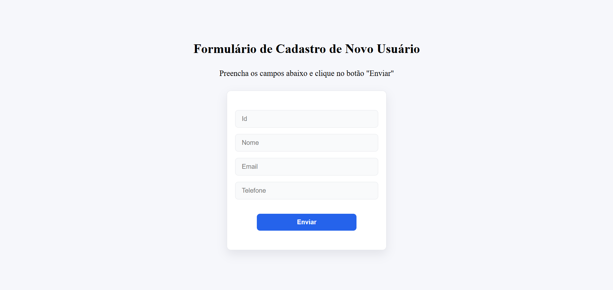
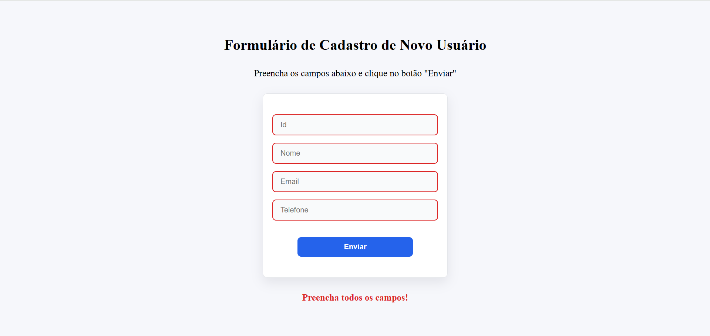
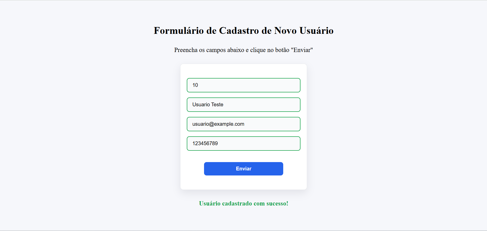

# Formulário de Cadastro com Validação

## Informações do Projeto

Este projeto é um formulário de cadastro de usuários desenvolvido com HTML, CSS e TypeScript, contendo validação completa de campos, mensagens de erro/sucesso e verificação de formato dos dados.
O objetivo é praticar conceitos essenciais de desenvolvimento web, como:

- Manipulação da DOM
- Eventos de formulário
- Boas práticas de TypeScript
- Expressões regulares (Regex)

## Funcionalidades

- Validação de campos input
- Validação de formato
- Exibição de mensagens personalizadas de erro/sucesso
- Prevenção do envio caso exista algum erro
- Estrutura de código organizada e tipada em TypeScript

## Tecnologias Utilizadas

- HTML
- CSS
- TYPESCRIPT

## Estrutura do Projeto

```
projeto-formulario-validacao/
│
├── index.html                  
├── readme.md                   
│
└── src/                        
    ├── css/                    
    │   ├── reset.css           
    │   ├── style.css           
    │   └── variables.css       
    │
    ├── images/                 
    │   ├── final-version.png       
    │   ├── final-version-error.png
    │   └── final-version-success.png 
    │
    └── js/                   
        ├── index.js          
        └── index.ts          
```

## Como Executar o Projeto

1. Clone o repositório:
   ```bash
   git clone https://github.com/andre-arcanjo/formulario-cadastro-validacao.git
   ```
2. Acesse a pasta do projeto:
   ```bash  
    cd formulario-cadastro-validacao
    ```
3. Abra o arquivo `index.html` em seu navegador.

## Resultado Final do Projeto






